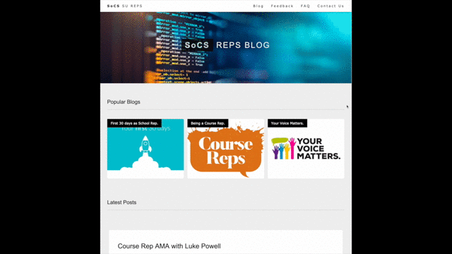

# SoCS SU Reps Web Blog

The SoCS SU Reps Web Blog has been created to provide an open and free space to ask any questions from any of the School Reps or Course Reps. It will be a central repository of comments through the year as well as a guide for further course reps. The content will be created entirely by the course reps and free from any influence of the University of Lincoln SoCS. The aim here is to ensure this space is completely neutral and to help provide the best quality feedback to the SoCS so that as reps we can make this the best school as possible. 

## Overview

This website has been created using the most basic of HTML/CSS/JS. The limited JS used in the site is purely to collate posts onto a single page and make it easier for contributers to link their blogs without having to go to several different pages. 

The reason to keep the site as simple as possible is to encourage as many contributors as possible who may not yet have experience in open source collaboration, or who may not be familiar with the Git process or web design in general. 

This project hopefully provides a very easy way to start your journey on open source software development using these tools. 

## Feedback Anonymity

Feedback is provided via Google Forms. We have used Google Forms so we have some way to collate feedback without requiring a user to provide any details at all - i.e. all feedback is completely anonymous. As the school and course reps we are then able to review the comments and provide the most constructive feedback to the school. Google Forms works well for this because it provides a feedback results dashboard. However, please note that all Google Form responses and results are viewable by anyone with a '@lincolnsu.com' email address. With this in mind please do not use any names, identifiable or personal details in the feedback.  

## Post or a Blog

There are 2 types of content available to be created. These are 'Posts' and 'Blogs'. A post is a short form article and consists of around 1 x paragraph of text and possibly an image. This is presented in the style of a 'card' on the main blog page. A blog is a longer form article and compliments a Post. You can use a Post to link through to the respective blog. A Blog consist of several paragraphs of text and perhaps multiple images/gifs/videos etc. A post is best used when only something short is required and a blog is best when you want to add more detail. Below shows what the main Blog page looks like with posts:

Each individual blog is a completely separate webpage which allows for a longer form of writing. If you only want to create a post because that covers everything then then that is no problem. There is no requirement for a dedicated blog page if you don't want one or if a post is good enough. 

**NAMING COVENTIONS**

To make it as easy as possible to create a post or a blog please name all your files the same name as the post. Please also use Camel Case and the naming convention as shown below:

**Post:**   myFirst30DaysAsSocsSchoolRep_POST.html

**Blog:**   myFirst30DaysAsSocsSchoolRep_BLOG.html

**Image:**   myFirst30DaysAsSocsSchoolRep_IMAGE1.html (then IMAGE2 .. and so on)

This will help separate out content from the website in general and if any images are lost it is easy to find which ones they are.

**Note on Image Sizes**

To make the formatting of the website as simple as possible there are 2 image sizes used. 

- About Us Images: 	400px x 400px
- Post Images: 		900px x 700px

Where possible please try to use these sizes as it helps keep the posts about the same size as well as working more evenly across screen sizes.

## How to create a new Post or Blog

**STEP 1 - Create your Post**

 - Navigate from your root folder to > posts
 - Duplicate a previous post such as 'myFirst30DaysAsSocsSchoolRep_POST.html' and rename
 - Open your new post and update the title, date, author name and post 'id'
 - Write a brief description of the blog
 - If you are using an image in your post then update the image source tag
 - If you are also creating a full blog page then also update the href tag
 - When you are finished save the file
 - If you want to create a corresponding blog then go to Step 2. If not, then go to Step 3

**STEP 2 - Create The Blog**

- In the 'posts' folder there is a 'blogs' folder. Open this.
- Duplicate a previous blog such as 'myFirst30DaysAsSocsSchoolRep_BLOG.html' and rename
- If you are adding Images please use the 'assets' folder to hold them
- Open your new blog and update with your new text, images, videos etc. Again, remember to update the href tag for any image links
- When you are finished save the file
- Go to Step 3

**STEP 3 - Add the Post to the main Blog page**

- Navigate to the main root folder of the project
- Here, you will see a file called 'blog.html'. Open it in your text editor of choice
- Under the section called 'posts' you will see a list 
- Copy one of the list entries and amend the 'data-include' tag to your blog post name (this should be the same name as your blogpost html page in Step 1)
- Add your entry to the top of this list
- The order of this list dictates the order of the posts on the blog page, so newer entries should go to the top

You're all done. Now just make the appropriate pull requests to get the site updated!

## How to Contribute to the GitHub Repo

Contributing to the website is easy and we encourage anyone who is interested to make pull requests. 

The general process of contributing on GitHub is widely documented however the outline process is below:

1. Identify where you want to host the project locally. This could be a projects folder for example. 

1. Clone the repository using GitHub desktop or the CLI into this location (CLI is recommended as this helps you become more familiar with Git in general)

1. If you are using a Text editor such as Sublime then the best place to start is by opening the 'index.html' file using Sublime or Vim.

1. To see the website locally you can either drag and drop the 'index.html' file into your browser bar or right click the file and select 'open with [your browser of choice]'.

1. Now make an edit to the index.html file and then refresh your browser to see the edit take effect

