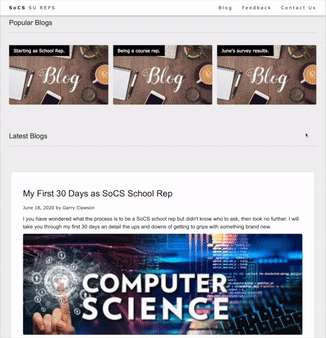

# SoCS SU Reps Web Blog

The SoCS SU Reps Web Blog has been created to provide an open and free space to ask any questions from any of the School Reps or Course Reps. It will be a central repository of comments through the year as well as a guide for further course reps. The content will be created entirely by the course reps and free from any influence of the University of Lincoln SoCS. The aim here is to ensure this space is completely neutral and to help provide the best quality feedback to the SoCS so that as reps we can make this the best school as possible. 

## Overview

This website has been created using the most basic of HTML/CSS/JS. The limited JS used in the site is purely to collate posts onto a single page and make it easier for contributers to link their blogs without having to go to several different pages. 

The reason to keep the site as simple as possible is to encourage as many contributors as possible who may not yet have experience in open source collaboration, or who may not be familiar with the Git process or web design in general. 

This project hopefully provides a very easy way to start your journey on open source software development using these tools. 

## Feedback Anonymity

Feedback is provided via Google Forms. We have used Google Forms so we have some way to collate feedback without requiring a user to provide any details at all - i.e. all feedback is completely anonymous. As the school and course reps we are then able to review the comments and provide the most constructive feedback to the school. Google Forms works well for this because it provides a feedback results dashboard. However, please note that all Google Form responses and results are viewable by anyone with a '@lincolnsu.com' email address. With this in mind please do not use any names, identifiable or personal details in the feedback.  

## How to add a new Blog

Blogs are created in 2 separate spaces. The is done first by creating a 'card'. This card populates the main 'Blogs' page. The card acts as an overview of the blog itself. Theese cards help guide users through all the available blogs on the site. See image below:

  

The 2nd element is creating the blog itself. The blog is a completely separate webpage itself which allows for a longer form of blog. If you only wanted to create a card then that is no problem. There is no requirement for a dedicated page if you don't want one. 

## How to Contribute

Contributing to the website is easy and we encourage all persons who are interested to raise any issues and make pull requests. 

The general process of contributing on GitHub is widely documented however the outline process is below:

1. Identify where you want to host the project locally. This could be a projects folder for example. 

1. Clone the repository using GitHub desktop of the CLI into this location (CLI is recommended as this helps you become more familiar with Git in general)

1. If you are using a Text editor such as Sublime then the best place to sdtart is by opening the 'index.html' file using Sublime or Vim.

1. To see the website locally you can either drag and drop the 'index/html' file into your browser bar or right click the file and select 'open with [your browser of choice]'.

1. Now make an edit to the index.html file and then refresh your browser to see the edit take effect

